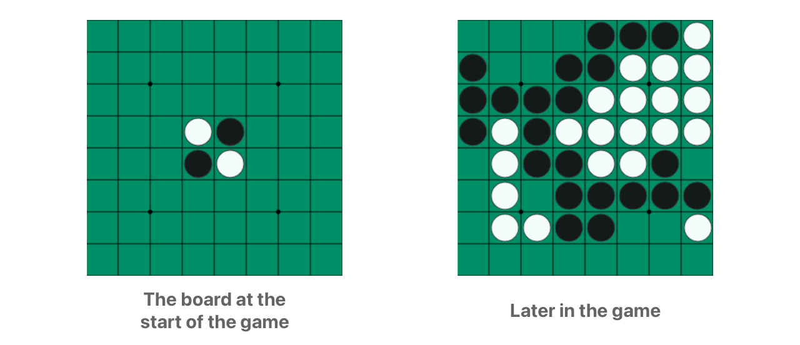
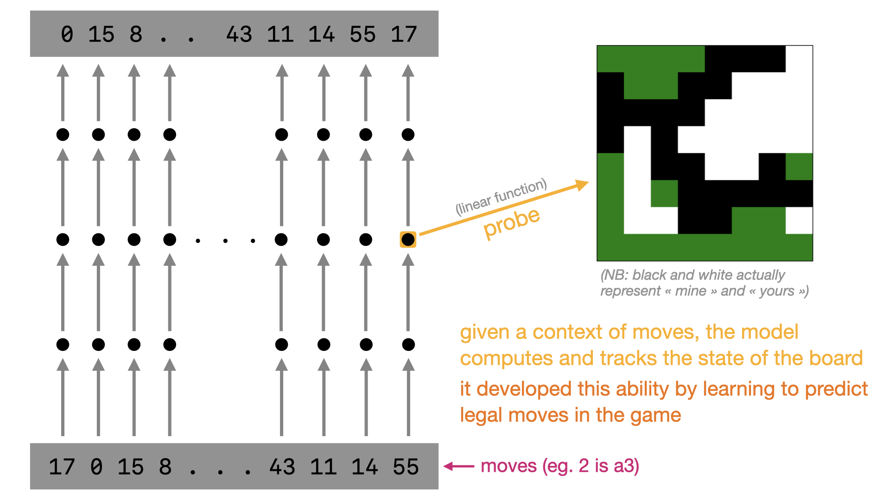
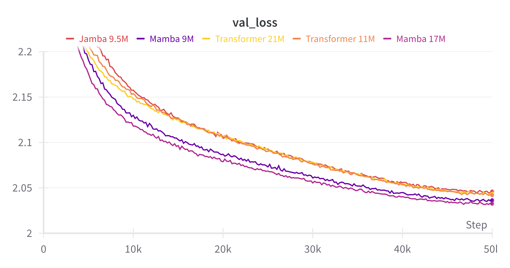
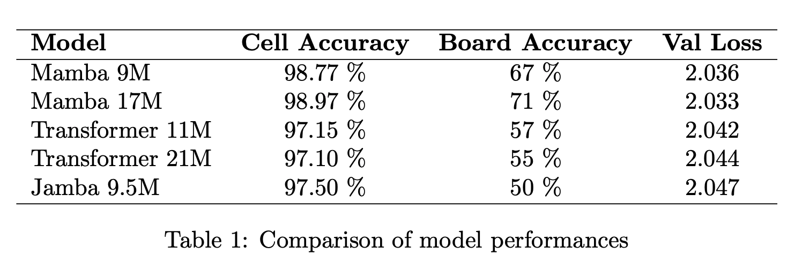
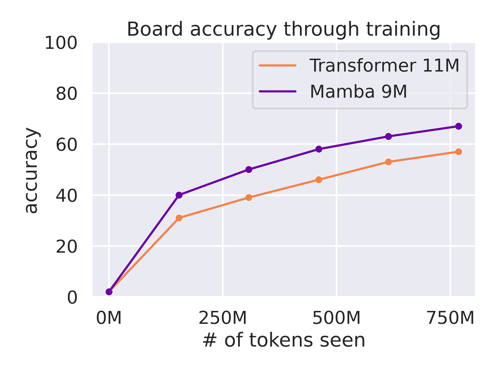
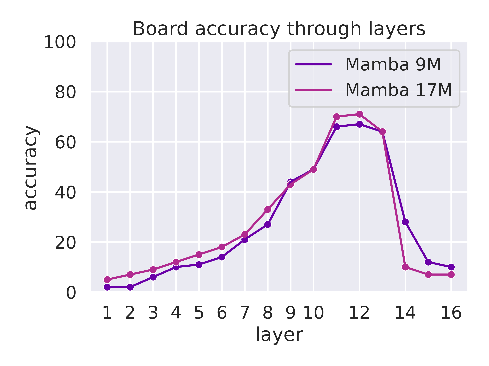
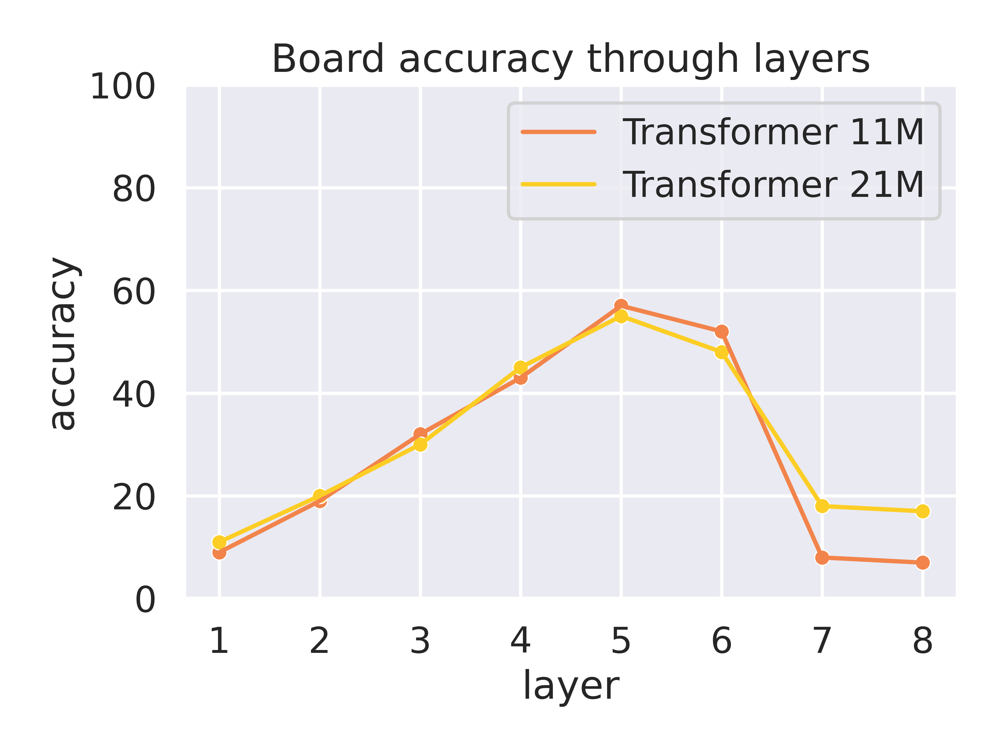
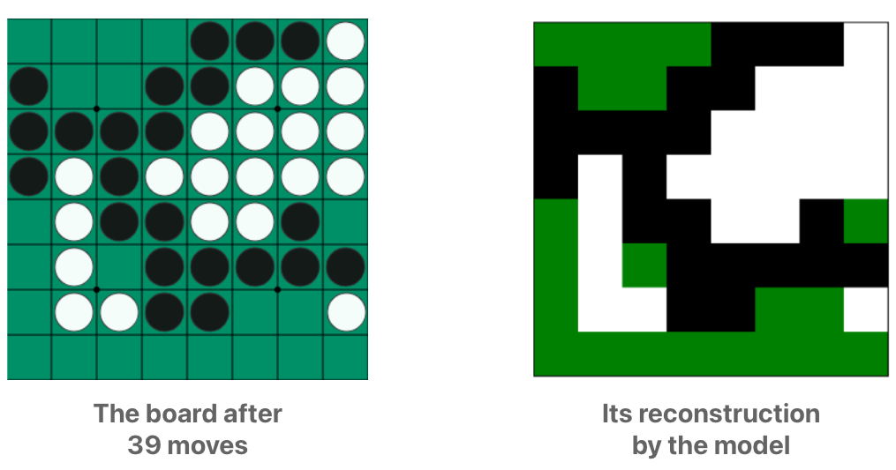
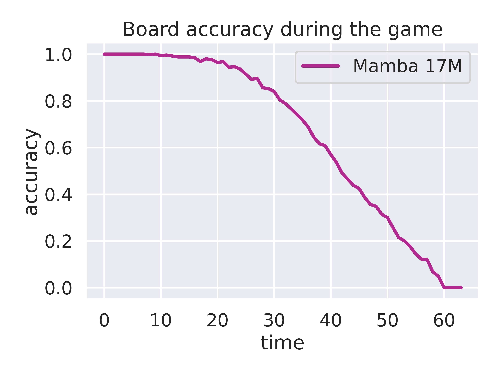

# Evaluating the Mamba architecture on the Othello game
This repo provides the code to implement the famous ["OthelloGPT" experiment](https://thegradient.pub/othello/) with the Mamba and Transformer architectures. It should be hackable enough to be modified to your needs - eg. replace Othello with chess.

<p align="center">
    
</p>

<u>The repo features</u> :
- a training script `train.py`, which trains a model that predicts legal moves in Othello.
- the model trained can then be used to train a probe on top of it, with `create_data_probing.py` and `train_probe.py`.
- the Transformer backend can be pure PyTorch or can use FlashAttention-2 (torch compile compatible). The Mamba backend can either be [mamba.py](https://github.com/alxndrTL/mamba.py) or the [official CUDA implementation](https://github.com/state-spaces/mamba).

It is a complete reimplementation of the [original repo](https://github.com/likenneth/othello_world).
It is designed to easily conduct the experiment from start to finish in separate and well-defined files : `train.py`, `create_data_probing.py` and `train_probe.py`. The `train.py` script creates a folder which is reused by downstream scripts, so you don't have to worry about carrying along model-specific hyperparameters.

## What is OthelloGPT ?

Othello is a board game played on a 8x8 grid where two players compete to flip their opponent's pieces to their own color by trapping them between their own pieces.

<p align="center">
    
</p>

You can try playing it [here](https://www.eothello.com/).

Each game is encoded as the list of moves played by both player since the beginning. For example `d5 d3 c7 f1 b2` means that black played `d5`, then white played `d3` and so on (black always starts the game). Each move is represented with a number between 0 and 59.

<b>The idea of the OthelloGPT experiment is simple :</b> <b>1)</b> we train the model to predict legal moves in the game. By doing so, the model develop a latent representation of the board, which we can then <b>2)</b> extract/interpret with a tiny model, a <i>probe</i>, which maps the model activations to a state of the board (the actual 8x8 grid).

<b>1) </b> To train the model to predict legal moves, we sample random Othello games, with moves choosen at random (but legal). We end up with millions of games, each of them being a 60ish-long-sequence like `0 15 8 42 2 58 14 ...` (as the four pieces in the middle are present at the start of the game, only 60 moves can be taken, if no forfeit happens before). We then train a sequence model (Transformer or Mamba in this case) on these sequences via log-likelihood maximization - ie they learn to predict the next move in the sequence given the previous moves. Note that the sequence of moves like `0 15 8 42 2 58 14 ...` doesn't give a trivial access to the state of board.

<b>2) </b> Then, we train a probe (a linear layer) from couples (activations, board state). This data is collected by sampling random Othello games, and by feeding the context of moves to the model and collecting the activations at a given layer, as well as the true state of the board. The simpler the probe, the better, as simple probes can only "translate" the features computed by the model and can't actually compute these features themselves, as opposed to more powerful probes (MLPs). The probes (one probe per square) are trained like in any classification task, with the number of classes being 3 (empty, mine and yours*).

Here is a diagram that shows the whole process :

<p align="center">
    
</p>

<i>*The model represents the board as square which are empty, "mine" and "yours" and not empty, black and white***. To try to understand why, it's important to note that the model is trained to play both black and white moves (`0 15 8 42 2 58 14 ...` is composed of both black and white moves). Hence, this representation works for all the moves to predict because it is independent of which players is going to play. It's easier to work with than the black/white board representation.</i>

<i>**We know that the representation is empty, "mine", "yours" as a linear probe is able to extract it, but fails to extract a empty, black, white representation. Only a non-linear probe is able to extract such a representation. Cf to what was said above : the simpler the probe, the better. Here, a non-linear don't fully extracts the representation but compute a part of it (from empty, "mine", "yours" to empty, black, white).</i>

If you want a more detailed explanation on why OthelloGPT matters, please see the [blog post](https://thegradient.pub/othello/) that introduced this experiment.
In a few words, <b>it implies that the model learned "something" about the process that generated the input sequence.</b> In this case, it developed a representation of the board that is part of the process used to generate the moves of the game. This is probably not the result of learning mere "surface statistics".

Note that this experiment seems to confirm this hypothesis only on a simple toy experiment, in a very controlled setting. This tells little about what happens in regimes like NLP, where the text comes from various different backgrounds.

The main contribution of this repo is to provide a <b>simple, clean and hackable implementation of the OthelloGPT experiment</b>, designed to be compatible with multiple architectures, and with little effort, other sources of data (eg. chess or something more sophisticated).

## Getting started
With this repo, you can train your own model (Transformer or Mamba) that predicts legal moves in Othello. Then, you can train a probe that to extract the board state from the activations of your trained model.

First, clone the repo :
```
git clone https://github.com/alxndrTL/othello_mamba
cd othello_mamba
```

Then, download the data, which consists of 23M of Othello games (converted from [this repo](https://github.com/likenneth/othello_world)):
```
wget -O data.tar.xz https://huggingface.co/datasets/alexandretl/othello/resolve/main/data.tar.xz?download=true
tar -xf data.tar.xz (1-2 minutes)
```

With this, you will have a `data` folder containing both a `train` and a `val` folder.
This will be used for the training of the model, as well as later when training the probe.

Now, you can train the base model (see `train.py` for hyperparameters like architecture, `d_model`, `lr`, ...):
```bash
python train.py # depending on the hyperparameters and your machine, can take between 30 min to a few hours
```

You will then have a `model.pth` checkpoint in the `runs/{run_name}` folder.
Now, create the data to train the probe with :
```
python create_data_probing.py --load_dir=runs/{run_name}
```

This will sample games from the `data/val` folder and create files of model activations and their corresponding board state.

Finally, you can train a probe with :
```bash
python train_probe.py --load_dir=runs/{run_name} # should take a few minutes only
```

Please check the files `train.py`, `create_data_probing.py`, `train_probe` for hyperparameters.

If you want to start from a pretrained model, please contact me and I will able to send you pretrained models via HF.

## Results
So, what about Mamba ?

I trained 4 models : a 9M Mamba and a 11M Transformer, as well as a 17M Mamba and a 21M Transformer. <i>(although other models can be found on the wandb page)</i>

First things first, here are the losses for each of these models :

<p align="center">
    
</p>

As you can see, the Mamba models are faster to train (data-wise) than the Transformers (about ~20% faster).
All runs use the same learning rate and batch size, and the number of iterations is also the same (50K).

How does this translate to our experiment ?
Both architectures rapidly reaches a ~100% accuracy when predicting legal moves in Othello. (by step 3000, the legal move accuracy is above 95% for all models).

For the probing accuracies, here are the results for these models :

<p align="center">
    
</p>

You can see that the lower loss reached by the Mamba models translates to a better accuracy - cell or board. The <b>cell accuracy</b> measures the proportion of cells/squares correctly classified, while the <b>board accuracy</b> measures the proportion of entire boards correctly classified. A board accuracy of 67% means that the probe of the Mamba 9M reconstructs perfectly 67% of the boards. While the previous works on OthelloGPT only tracked the cell accuracy, I find the board accuracy number to be more representative of the quality of the world model that each models computes.

Here is the evolution of the board accuracy through training :

<p align="center">
    
</p>

We can try fitting a probe at different layers of ours models. Hence, we can track how the board representation is built, when it is used, and finally when it is discarded :

<div style="text-align:center;">
    
    
</div>

We can see how the representation is progressevily built in the early layers (1->12 for Mamba, 1->5 for the Transformer), and then discarded in the final layers (14,15,16 for Mamba, 7,8 for the Transformer). Once the representation is built, the model uses it in the final layers to compute the next legal move to play. It is therefore not needed anymore in those layers.

Here is an example of the reconstruction of a board :

<p align="center">
    
</p>

Again, it's important to remember that the model never has access to the board in itself, it just sees the list of moves since the beginning of the game.

As one can imagine, the board gets more and more complicated as the game progesses. This is thus not suprising to see that the mean board accuracy evolves like this through the game :

<p align="center">
    
</p>

The boards at the beginning of the game is very simple as it is composed of only a few pieces, while a late-game board is much harder to keep track of. Reconstructing the board from the list of moves is not something very easy (although of course it can be coded easily), compared to chess for example.

To conclude, we see that the Mamba performances are on par and even a bit better than those of the Transformer. I think this experiment is interesting as it shows that the hidden state of Mamba is powerful enough to allow the computation of this representation.

You can find all the models I trained for this project on the [wandb page](https://wandb.ai/alexandretl/othello).

<b>The main next steps for this projet are :</b> 
- train longer (especially the biggest models)
- use other sources than Othello games (chess, and even more complex)... The original goal of this experiment is to show that the model learned "something" about the process that generated the input sequence (some kind of a world model). It would be intersting to see if this hypothesis holds for more complex examples.


## Learn more
- the first experiments were proposed in [Emergent World Representations: Exploring a Sequence Model Trained on a Synthetic Task](https://arxiv.org/abs/2210.13382). Li et al. successfully trained a GPT to output legal moves, and trained a (non-linear) probe to extract its representation of the board. However, the probe they trained was tasked to tell if a given square is empty, black or white given the model's activations. ([blog post](https://thegradient.pub/othello/), [code](https://github.com/likenneth/othello_world))
- then, in [Emergent Linear Representations in World Models of Self-Supervised Sequence Models](https://arxiv.org/abs/2309.00941), Nanda et al. showed that a linear probe is sufficient, given that we task it to tell if a given square is "mine" or "yours". ([blog post](https://www.lesswrong.com/posts/nmxzr2zsjNtjaHh7x/actually-othello-gpt-has-a-linear-emergent-world#Citation_Info), [code](https://github.com/likenneth/othello_world/tree/master/mechanistic_interpretability)) Their paper and blog is targeted to lie in the field of mechanistic interpretability (of the Transformer).

- more recently, Hazineh et al. reproduced the above experiments in [Linear Latent World Models in Simple Transformers: A Case Study on Othello-GPT](https://arxiv.org/abs/2310.07582), with a focus on intervention and shallow models.

## TODOs:
- intervention : "reverse" the probe to modify the internal representation of the model
- adapt for chess
- see main next steps in the Results section
